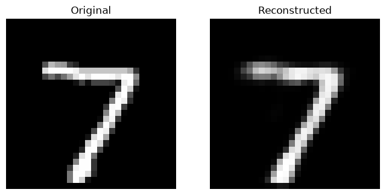

# MNIST Autoencoder

My first TensorFlow/Keras autoencoder project using the MNIST handwritten digit dataset.

## Project Overview

This project builds an autoencoder that learns to reconstruct handwritten digits.

The encoder compresses each 28×28 image into a 64-dimensional representation, and the decoder reconstructs the image.

## Technologies

* Python
* TensorFlow 2.21.0
* Keras 3.15.1
* Jupyter Notebook
* Matplotlib

## Dataset

The project uses the MNIST handwritten digit dataset:

* 60,000 training images
* 10,000 test images
* Each image is 28×28 pixels

## Results

### Original vs Reconstructed Digit 7

The image above shows the original handwritten digit and the digit reconst
